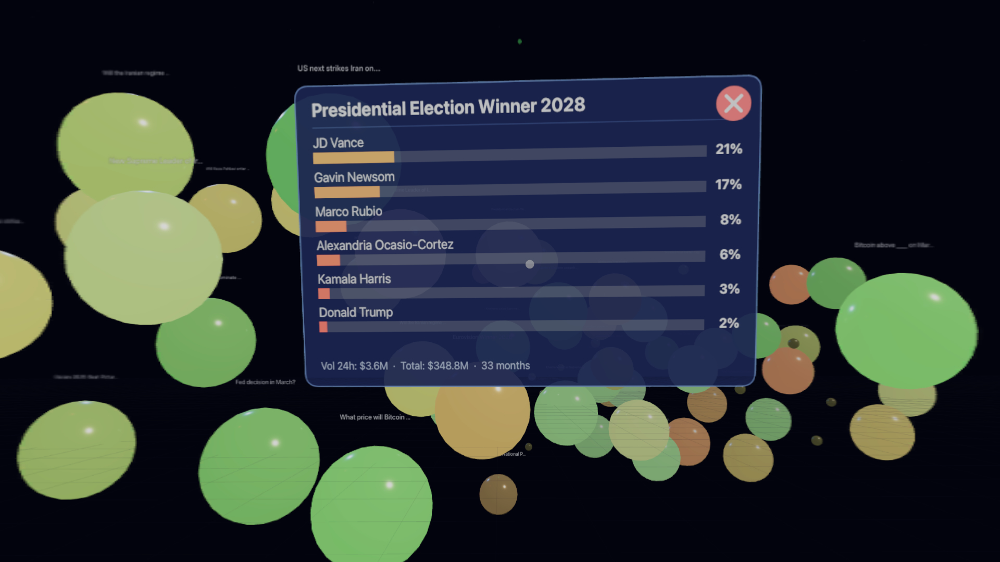

# Prediction Space

A WebXR visualization of live prediction markets from [Polymarket](https://polymarket.com). Walk through a 3D space of glowing spheres — each one a live market — sized by trading volume, colored by probability, and clustered by category. Built for Apple Vision Pro, Meta Quest, and desktop browsers.



## What It Does

Prediction Space pulls live market data from Polymarket's API every 2 minutes and renders each active event as a sphere floating in 3D space:

- **Size** reflects 24-hour trading volume (logarithmic scale)
- **Color** maps probability to a red-green spectrum — high-confidence markets glow green, uncertain ones burn red
- **Brightness** indicates activity — hot markets with surging volume are vivid and saturated, quiet ones fade into the background
- **Position** groups markets by category (politics, crypto, sports, tech, science, culture, finance) in distinct 3D zones
- **Near-resolution markets** drift toward the floor as their end date approaches
- **Volume spikes** trigger a 5-second pulsing animation when a market's 24h volume jumps 50%+

Click any sphere to see the full breakdown: outcome probabilities as colored bars, trading volume, time to resolution, and a link to the market on Polymarket.

## VR Interaction

In WebXR (Vision Pro, Quest, or any WebXR-capable headset):

| Gesture | Action |
|---|---|
| **Look at a sphere** | Highlights it (scale + glow) |
| **Pinch while looking at a sphere** | Opens a 3D detail panel |
| **Pinch while looking away** | Dismisses the panel |
| **Two-hand pinch: spread/contract** | Move the scene forward/backward |
| **Two-hand pinch: move up/down** | Move the scene vertically |
| **Two-hand pinch: move left/right** | Move the scene laterally |
| **Two-hand pinch: rotate** | Spin the scene around its center |

A gaze reticle (small ring) follows your head direction so you always know where you're pointing. Hand tracking is used for pinch detection — no controllers required.

On desktop, orbit controls let you click-drag to rotate, scroll to zoom, and click spheres for the HTML detail panel.

## Architecture

Zero dependencies on the client. No build step, no bundler — just ES modules served directly with an import map pointing to Three.js on CDN.

```
prediction-space/
  index.html          # Single-page app with inline styles and import map
  server.js           # Node.js server: static files + Polymarket API proxy
  src/
    main.js           # Animation loop, data polling, wires everything together
    scene.js          # Three.js scene, camera, lighting, bloom, XR controllers + hands
    visualization.js  # Market data → 3D spheres (sizing, coloring, layout, animation)
    interaction.js    # Gaze tracking, pinch selection, 3D panel, two-hand gestures
    data/
      polymarket.js   # Polymarket Gamma API client with polling + change detection
```

**Server** (`server.js`): A lightweight Node.js HTTP server that serves static files and proxies requests to the Polymarket Gamma API (to avoid CORS issues). Includes rate limiting (30 req/min per IP), path whitelisting, and blocks sensitive files. Designed to sit behind a reverse proxy (Caddy, nginx) for TLS.

**Scene** (`scene.js`): Sets up the Three.js renderer with WebXR enabled, bloom post-processing (UnrealBloomPass), orbit controls, atmospheric lighting (hemisphere + directional + point lights), a grid floor, and a starfield. Initializes XR controllers (indices 0-3 for standard + Vision Pro transient pointers) and hand tracking with `XRHandModelFactory`.

**Visualization** (`visualization.js`): Transforms market events into `IcosahedronGeometry` spheres with glassy `MeshStandardMaterial`. Uses a golden-angle spiral layout within category zones, smooth position/scale lerping, distance-based label fading, and per-frame idle animations (bob + rotation). Detects volume spikes and triggers pulse effects.

**Interaction** (`interaction.js`): Implements a gaze-first interaction model. In XR, raycasts from the camera's forward direction each frame for hover detection. Pinch events (via `selectstart` on all 4 controller indices) check the gazed target. The 3D detail panel is a canvas-textured plane with outcome bars rendered via Canvas 2D API — no HTML overlays (they don't work in VR). Two-hand pinch gestures track thumb-tip/index-finger-tip joint distances for zoom/pan/rotate with full 3-axis translation.

**Data** (`polymarket.js`): Fetches from the Polymarket Gamma API, normalizes events with aggregated volumes across sub-markets, and handles binary Yes/No markets intelligently (uses `groupItemTitle` instead of generic "Yes"/"No" labels). Polls on an interval with change detection for volume spikes (>50% increase) and price swings (>10pp shift).

## Running Locally

```bash
node server.js
```

Opens on `http://localhost:8003`. To restrict CORS to a specific origin:

```bash
ALLOWED_ORIGIN=https://yourdomain.com node server.js
```

For WebXR testing you'll need HTTPS — put it behind a reverse proxy (Caddy, nginx) or generate self-signed certs for local development.

## Tech

- [Three.js](https://threejs.org/) r170 (via CDN import map)
- WebXR Device API with `hand-tracking` optional feature
- Polymarket Gamma API (proxied through the Node server)
- Canvas 2D API for in-world text rendering
- Zero client-side dependencies, zero build tools

## License

[MIT](LICENSE)
